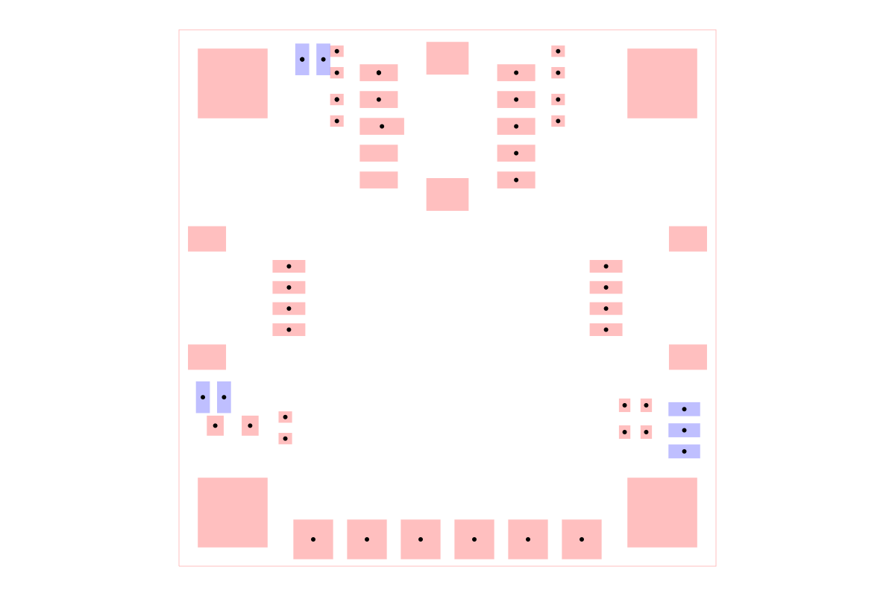

# dataset-srj05

A collection of 87 Simple Route JSON autorouting problems converted from
open-source SparkFun breakout boards. The samples cover sensors, connectors,
level shifters, adapters, storage, radio, USB, and other small production PCB
layouts. Each board directory contains its source tscircuit module and a
matching `*.circuit.simple-route.json` routing problem.

## Example

`sample001` is the SparkFun FS3000-1005 air-velocity sensor breakout. The image
below is generated by constructing an `AutoroutingPipelineSolver` from that
sample, calling `.visualize()`, and converting the returned graphics object to
SVG with `graphics-debug`.



Regenerate the image with `bun run generate:readme-image`.

## Browse the dataset

```sh
bun install
bun run cosmos
```

`bun run build:site` exports the browser to `cosmos-export/`; `vercel.json`
uses that command and directory for deployments.
